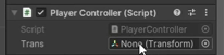

# Programowanie C#

---
## Spis treści
- [Programowanie C#](ProgramowanieCSharp.md)
  - [GetComponent](#getcomponent)
  - [Rzutowanie](#rzutowanie)
  - [Tablice](#tablice)
  - [Listy](#listy)
  - [Sortowanie tablic / list](#sortowanie-tablic--list)
  - [Kolejność eventów](#kolejność-eventów)
  - [Vector](#vector)
  - [Time.deltaTime](#timedeltatime)
  - [Właściwości](#właściwości)
  - [Korutyny (Coroutine)](#korutyny-coroutine)
---
### GetComponent
 - `GetComponent` - instrukcja która pomoże dostać się do danego komponentu

by zmienić kolor sprite'a:
```csharp
void Start(){
    GetComponent<SpriteRenderer>().color = Color.blue;
}
```
jeśli do danego komponentu odwołujemy się więcej niż raz to lepiej zapisać takie powiązanie w zmiennej:

```csharp
SpriteRenderer spriteRenderer;

void Start(){
    spriteRenderer = GetComponent<SpriteRenderer>();
    spriteRenderer.color = Color.red;
}
```

Serialized Field - dzięki temu zmienna jest serializowana i będzie pokazana w inspektorze

```csharp
[SerializedField] Transform trans;
```

lub transform w taki sposób:
`transform.position = ...`

---
### Rzutowanie
**Rzutowanie niejawne**
Mniejsze typy można rzutować automatycznie na większe poprzez rzutowanie niejawne

`byte` > `int` > `long` > `float` > `double`

```csharp
int value = 8;
long fl = value;
```

**Rzutowanie jawne**
Jeśli chcemy zmienić typ na mniejszy należy manualnie zmienić typ zapisując go w nawiasie

```csharp
int value = 8;
byte bt = (byte)value;
```
---
### Tablice
Sposób który jest często używany w Unity
```csharp
[SerializeField] GameObject[] enemies;
```

Pojawia się tablica do której można dołączać prefaby


Losowa zmiana koloru gracza z dostępnych kolorów w tablicy:

```csharp
[SerializeField] Color32[] colors;
void Start()
{
  int randNum = Random.Range(0, colors.Length);
  GetComponent<SpriteRenderer>().color = colors[randNum];
}
```
![Colors[]](ss/colors[].png)
**Uwaga!** Domyślnie ustawia się kanał alfa 0, więc trzeba zmienić na 255

---
### Listy
Są dynamiczne w porównaniu do tablic
```csharp
List<string>cars = new();
void Start()
{
  cars.Add("Ferrari");
  cars.Add("Audi");

  cars.RemoveAt(1);
  Debug.Log(cars.Count); // zlicza ilość aut
}
```
Przypisywanie w inspektorze:
```csharp
[SerializeField] List<string>cars;
```
---
### Sortowanie tablic / list
Sortowanie tablic (stringowe lub numeryczne):
```csharp
string[] arr = {"Piotr", "Adam", "Kasia", "Wacław", "Klara"};

Array.Sort(arr); // rosnąco
Array.Reverse(arr); // malejąco
```
Sortowanie list (stringowe lub numeryczne):
```csharp
List<int>numb = new();
numb.Add(4);
numb.Add(9);
numb.Add(2);
numb.Add(3);

numb.Sort(); // rosnąco
numb.Reverse(); // malejąco
```

---
### Kolejność eventów

- `Awake()` - wykonuje się jeszcze szybciej niż `Start()`
- `Start()` - wykonuje się przy uruchomieniu
- `fixedUpdate()` - działa podobnie jak `Update()`, stosowany głównie do obliczeń związanych z fizyką, wykonuje się określoną ilość razy (domyślnie 50 razy na sekundę)
- `Update()` - jest wywoływane automatycznie w każdej klatce gry
- `LateUpdate()` - wykonuje się później, kiedy `Update()` zakończy swoje działanie

Więcej tutaj: [Execution Order](https://docs.unity3d.com/6000.1/Documentation/Manual/execution-order.html)

---
### Vector
Tworzenie nowego wektoru
```csharp
Vector3 vec = new Vector3(2f, 1f, 4f);
```
Ustawienie gracza na pozycji zero i przesuwanie go w prawo:
```csharp
void Start()
{
  transform.position = Vector3.zero; // zeroVector - Vector3(0f, 0f, 0f)
}

void Update()
{
  transform.position += Vector3.right // rightVector - Vector3(1f, 0f, 0f)
}
```
Poruszanie się w stronę przeciwnika:
`public static Vector3 MoveTowards(Vector3 current, Vector3 target, float maxDistanceDelta)`
```csharp
[SerializeField] Transform enemy;
void Update()
{
  transform.position += Vector3.MoveTorwards(transform.position, enemy.position, Time.deltaTime)
}
```

---
### Time.deltaTime
Specjalna właściwość, która zwraca nam jaki czas upłynął od wykonania ostatniej klatki. Wykorzystywana w metodach `Update()` i `LateUpdate()`. Dzięki temu na każdym komputerze gra będzie wyglądać tak samo.

Dla poprawienia wydajności lepiej skorzystać z takiej kolejności zapisu:
```csharp
float speed = 3f;
void Update()
{
  transform.position += speed * Time.deltaTime * Vecto3.right;
}
```
Poprzez zmienną `speed` dostosowujemy prędkość poruszania

---
### Właściwości
`{ get; set; }` - pobieranie i nadpisanie wartości
Muszą być publiczne
```csharp
public int Hp { get; private set; } // skrócony zapis
// właściwość jest publiczna, można z zewnątrz pobrać wartość natomiast ustawić nie można
```
Praktyczny przykład z rozszerzonym zapisem:
```csharp
private int health; // prywatne pole

public int Health   // publiczna właściwość
{
    get { return health; }
    set
    {
        if (value < 0)
            health = 0;
        else
            health = value;
    }
}

void Start()
{
    Health = 100;  // Ustawianie przez właściwość
    Debug.Log("Gracz ma " + Health + " HP"); // Odczyt przez właściwość
}
```
Wyjaśnienie:
- `health` to prywatna zmienna.

- `Health` to właściwość, która pozwala:
  - Odczytać wartość (get)
  - Ustawić wartość (set) — ale tylko jeśli jest większa od 0.
- Dzięki temu chronimy zmienną health przed złymi wartościami.

Wykorzystujemy właściwości gdy:
- chcemy kontolować dostęp do zmiennej
- chcemy wykonać jakąś logikę przy zmienie lub odczycie

Aby było widoczne w inspektorze
```csharp
[field:SerializeField] public int Hp { get; private set; }
```

---
### Korutyny (Coroutine)
To specjalna metoda w Unity, która działa asynchronicznie — pozwala „rozciągnąć” wykonanie kodu w czasie. Dzięki niej możesz np. czekać kilka sekund, ale bez zatrzymywania całej gry.

Tworzenie korutyny, która pozwoli po czasie usunąć obiekt:
```csharp
void Update()
{
  if(Input.GetMouseButtonDown(0))
  {
    StartCoroutine(Die());
  }
}
IEnumerator Die()
{
  Debug.Log("You died!");
  yield return new WaitForSeconds(1f);
  Destroy(gameObject);
}
```
Rozmywanie się obiektu:
```csharp
IEnumerator myFadeCoroutine;

void Start()
{
  myFadeCoroutine = Fade();
}

void Update()
{
  if(Input.GetMouseButtonDown(0))
  {
    StartCoroutine(myFadeCoroutine);
  }
  if(Input.GetMouseButtonDown(1))
  {
    StopCoroutine(myFadeCoroutine);
  }
}

IEnumerator Fade()
{
  SpriteRenderer spriteRenderer = GetComponent<SpriteRenderer>();
  Color32 color = Color.white;

  for(int i = 255; i >= 0; i--)
  {
    yield return new WaitForSeconds(0.02f);
    spriteRenderer.color = new Color32(color.r, color.g, color.b, (byte)i);
  }
}
```

---
### InvokeRepeating()
To metoda w Unity, która automatycznie wywołuje inną metodę cyklicznie, co określony czas.
Składnia:
`InvokeRepeating("NazwaMetody", czasPierwszegoWywołania, interwał);`

Parametry:
- `"NazwaMetody"` – nazwa metody (jako string), która ma być wywoływana.

- `czasPierwszegoWywołania` – po ilu sekundach od uruchomienia wywołać pierwszy raz.

- `interwał` – co ile sekund powtarzać wywołanie.

Przykład:
Generowanie losowych wrogów w losowych miejscach
```csharp
[SerializeField] GameObject enemyPrefab;
[SerializeField] Sprite[] sprites;
void Start()
{
    InvokeRepeating("SpawnEnemy", 1f, 2f);
}

void Update()
{
  if(Input.GetMouseButtonDown(0))
  {
    CancelInvoke("SpawnEnemy"); // Przerywa działanie
  }
}
void SpawnEnemy()
{
    GameObject enemy = Instantiate(enemyPrefab); // Tworzy kopię obiektu enemyPrefab w grze.
    enemy.GetComponent<SpriteRenderer>().sprite = sprites[Random.Range(0, sprites.Length)]; // Przypisuje mu losowy sprite z tablicy sprites.
    enemy.transform.position = new Vector2(Random.Range(-8f, 8f), Random.Range(-4f, 4f)); // Wróg pojawia się w losowym miejscu w tym prostokącie.
}
```