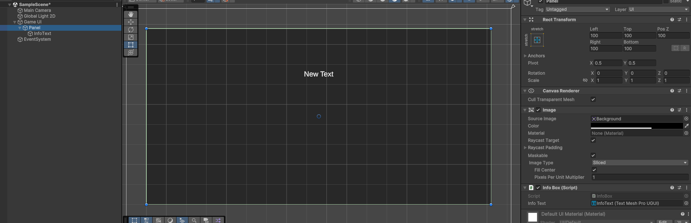
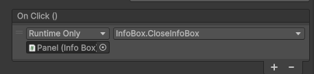
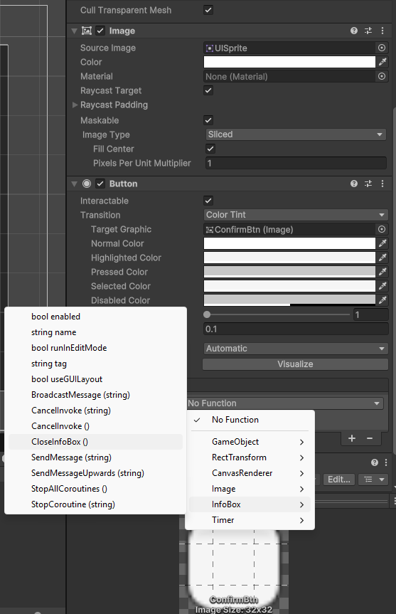

# UI - User Interface

---
## Spis treści
- [UI - User Interface](#ui---user-interface.md)
  - [Canvas / Panel](#canvas--panel)
  - [TextMeshPro](#textmeshpro)
  - [Button](#button)

---
### Canvas / Panel
**Canvas** to specjalny obiekt w Unity, który przechowuje wszystkie elementy UI. Bez Canvas żadne elementy UI nie będą widoczne na ekranie.

**Panel** to pusty prostokąt wewnątrz Canvasa, który możesz używać jako tło, grupę elementów albo okno.

---
### TextMeshPro



Żeby dostać się do tekstu w kodzie:
Na starcie trzeba dodać:

```csharp
using TMPro;
```
```csharp
[SerializeField] TMP_Text infoText;
void Start()
{
    infoText.text = "Witaj Świecie";
}
```
**Skrypt trzeba dodać do panelu!**
Najlepiej jak obiekt nazywa się identycznie jak pole `SerializeField` jest się wtedy łatwiej się połapać :)

---
### Button
Na początek trzeba napisać funkcję która po wciśnięciu przycisku się wywołuje:
```csharp
public void CloseInfoBox() // funkcja musi być publiczna
{
    gameObject.SetActive(false); // Zamyka UI
}
```
Później w inspektorze przycisku dodajemy napisaną funkcję do onClick()




---
### 