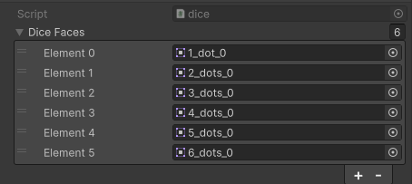

# Zadania

1. Napisz skrypt, który po wcisnięciu lewego przycisku myszy rzuci kostką

```csharp
using System.Collections;
using UnityEngine;

public class dice : MonoBehaviour
{
    SpriteRenderer spriteRenderer;
    [SerializeField] Sprite[] diceFaces;
    void Start()
    {
        spriteRenderer = GetComponent<SpriteRenderer>();
    }

    void Update()
    {
        if(Input.GetMouseButtonDown(0))
        {
            StartCoroutine(Roll());
        }
    }
    IEnumerator Roll()
    {
        int i = Random.Range(1, 7);
        int randomIndex = Random.Range(0, diceFaces.Length);
        yield return new WaitForSeconds(1f);
        spriteRenderer.sprite = diceFaces[randomIndex];
    }
}
```
W inspektorze trzeba dodać png ścian kostek:



---
2. Stwórz UI, dodaj obiekt TextMeshPro i sformatuj go, aby tekst prezentował się prawidłowo. Dodaj skrypt, wyświetlający czas (w pełnych sekundach), który upłynął od czasu uruchomienia programu.

```csharp
using UnityEngine;
using TMPro;
public class Timer : MonoBehaviour
{
    [SerializeField] TMP_Text timerText;
    void Update()
    {
        int time = Mathf.FloorToInt(Time.time); // Przekształca liczbę float na pełną liczbę całkowitą poprzez zaokrąglenie w dół.
        timerText.text = $"{time} s";
    }
}
```

---
3. 