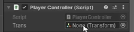

# Unity Engine

## Spis treści
- [Unity Engine](#unity-engine)
  - [Spis treści](#spis-treści)
  - [Programowanie C#](#programowanie-c)
    - [Kolejność eventów](#kolejność-eventów)
    - [Vector](#vector)


## Programowanie C#
 - `GetComponent` - instrukcja która pomoże dostać się do danego komponentu

by zmienić kolor sprite'a:
```csharp
void Start(){
    GetComponent<SpriteRenderer>().color = Color.blue;
}
```
jeśli do danego komponentu odwołujemy się więcej niż raz to lepiej zapisać takie powiązanie w zmiennej:

```csharp
SpriteRenderer spriteRenderer;

void Start(){
    spriteRenderer = GetComponent<SpriteRenderer>();
    spriteRenderer.color = Color.red;
}
```

Serialized Field - dzięki temu zmienna jest serializowana i będzie pokazana w inspektorze

```csharp
[SerializedField] Transform trans;
```

lub transform w taki sposób:
`transform.position = ...`

### Rzutowanie
**Rzutowanie niejawne**
Mniejsze typy można rzutować automatycznie na większe poprzez rzutowanie niejawne

`byte` > `int` > `long` > `float` > `double`

```csharp
int value = 8;
long fl = value;
```
**Rzutowanie jawne**
Jeśli chcemy zmienić typ na mniejszy należy manualnie zmienić typ zapisując go w nawiasie

```csharp
int value = 8;
byte bt = (byte)value;
```

### Kolejność eventów

- `Awake()` - wykonuje się jeszcze szybciej niż `Start()`
- `Start()` - wykonuje się przy uruchomieniu
- `fixedUpdate()` - działa podobnie jak `Update()`, stosowany głównie do obliczeń związanych z fizyką, wykonuje się określoną ilość razy (domyślnie 50 razy na sekundę)
- `Update()` - jest wywoływane automatycznie w każdej klatce gry
- `LateUpdate()` - wykonuje się później, kiedy `Update()` zakończy swoje działanie

Więcej tutaj: [Execution Order](https://docs.unity3d.com/6000.1/Documentation/Manual/execution-order.html)

### Vector
Tworzenie nowego wektoru
```csharp
Vector3 vec = new Vector3(2f, 1f, 4f);
```
Ustawienie gracza na pozycji zero i przesuwanie go w prawo:
```csharp
void Start()
{
  transform.position = Vector3.zero; // zeroVector - Vector3(0f, 0f, 0f)
}

void Update()
{
  transform.position += Vector3.right // rightVector - Vector3(1f, 0f, 0f)
}
```
Poruszanie się w stronę przeciwnika:
`public static Vector3 MoveTowards(Vector3 current, Vector3 target, float maxDistanceDelta)`
```csharp
[SerializeField] Transform enemy;

void Update()
{
  transform.position += Vector3.MoveTorwards(transform.position, enemy.position, Time.deltaTime)
}
```

### Time.deltaTime
Specjalna właściwość, która zwraca nam jaki czas upłynął od wykonania ostatniej klatki. Wykorzystywana w metodach `Update()` i `LateUpdate()`. Dzięki temu na każdym komputerze gra będzie wyglądać tak samo.

Dla poprawienia wydajności lepiej skorzystać z takiej kolejności zapisu:
```csharp
float speed = 3f;
void Update()
{
  transform.position += speed * Time.deltaTime * Vecto3.right;
}
```
Poprzez zmienną `speed` dostosowujemy prędkość poruszania